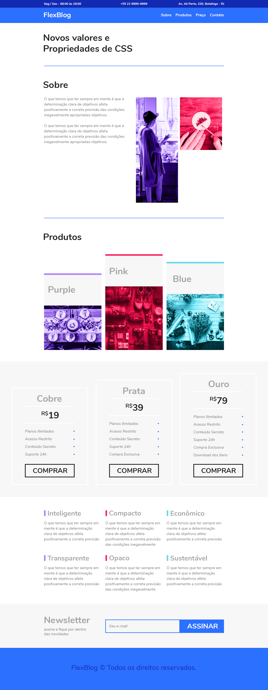

	<h1>FlexBlog - Estudando FlexBox</h1>

No Curso de 'CSS Flexbox' da origamid, foi criado um site responsivo utilizando apenas as propriedades do flexbox no alinhamento, evitando o uso de valores fixos e elementos flutuantes. 

O conteúdo do site não era o foco do curso, portanto seu layout serviu para tratar do básico ao avançado do flexbox, passando pelos fundamentos e propriedades mais básicas até combinações mais avançadas nas colunas e linhas. 

Para visualização final, entre em: <a href="https://fernandnsp.github.io/Estudo-Flexbox_Flexblog/">Flexblog - Fernanda Sene.</a>

 

 

	

